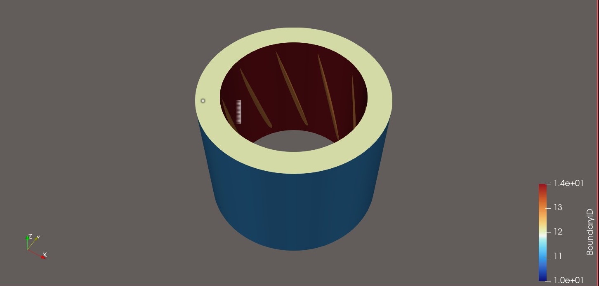
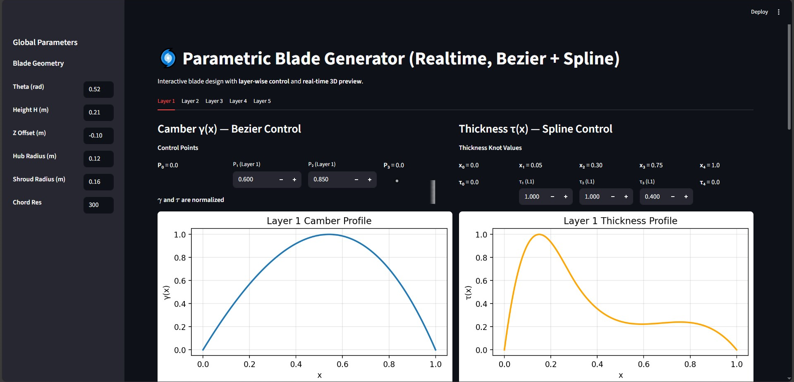

# Parametric Impeller Summoner 🏭

> Preprocess of the Symmetric-based Physics Oriented Neural Integral Computation [SymPhONIC](https://github.com/LokimuKH19/SymPhONIC), which is a novel PINN framework dedicated to analyzing impellers

## Contents
- `BladeGenerator.py`: to create a **parametric** 3D-Blade 
- `Assembly.py`: to **parametricly** summon a certain turbo machinery
- `FluidSummoning.py`: to compute the fluid domain of the previous **parametric** turbo machinery
- `BladeUI.py`: to create a Bezier + Spline Blade manually
- `run.bat`: to start the `BladeUI.py`


## 🖊 Update Records 
### Sept.12, 2025
- Ensured that generated models are watertight, closed volumes and can be directly imported into CAD / 3D modeling software.
- All geometric and design parameters can be transferred via a JSON file to fully describe a pump design. Direct usage of STL/VTK files is optional and not required, reducing storage overhead.

### Sept.14, 2025
- 1. Updates to `assembly.py`:
  - Outlet shaft and diffuser modeling fixed: Previously, the outlet shaft penetrated the diffuser without properly subtracting volume, leaving a hollow interior. Now, the diffuser and shaft are correctly combined so the solid domain is physically consistent.
  - Water-tightness checks reinforced: Ensured that the assembly, including rotor, vane, inlet, and outlet, passes watertight validation, making it suitable for CFD preprocessing.
  - Preparation for CFD-ready flow domain: Adjustments were made so that flow regions can be properly subtracted from solids without geometry errors.
  - Some small improvements on its robustness
- 2. New module: `FluidSummoning.py`: Provides the ability to generate CFD-ready fluid domains corresponding to pump components.
 
### Sept.20 2025
- Apologies for the long pause in updates. A new function in `FluidSummoning.py` has been proposed which can choose the **filetype**(`vtk/stl/both/json_only`) of the exported fluid domain. Among them the `vtk` mode contains the Naming/Numbering Function of each surfaces with traingle mesh exported to the `FluidDomain` folder, of which a description `json` file starts with "BoundaryID_Map" contrains the description of the correspounding relationship between the number (for the convenience of being identified by Ansys Fluent and similar commercial softwares) and the name of each boundary.
- An example of the vane region (`./FluidDomain/vane_FluidDomain_20250920_185607.vtk` opened by ParaView):

  

### Dec. 23, 2025
- I'm gald to tell you who has been watching this repo for long that I had finished the blade parametric modeling Demo to create a 3D blade in very short time. What you are about to do is to start the `run.py` and design a blade by modifying the values in the inputbox in accordance.
- Updated `BladeGenerator.py`: Support Bezier-Spline hybrid interpolation for, which follows the mainstream methods to create the blade for later blade optimization in broader applications.
- Added `BladeUI.py` and the correspounding `run.bat`.

### Dec. 24, 2025
- Updated `BladeUI.py`. Improved the readibility (contrast effect) of the UI.

  

### Dec. 25, 2025
- Updated `FluidSummoning.py`. Fixed the crash when trying to summon a fluid domain without vane zone

### Jan. 5, 2026
- New programm `BladeGeneratorCAD.py` is released. Now the parametric modeling of the blade in the axial fluid machinery can export the `.step` file with OpenCasCade engine (need conda environment), in which the format of the 3D model is CFD-meshing-friendly **B-rep**. So far the upper and lower bound of the blade is Polygon, and I'm going to upgrade this to NURB/Spline Surface later.

### Jan. 6, 2026
- Updated `BladeGeneratorCAD.py`: Now the shape of the Blades has been turned into the NURB surface. Running the script would create several files in the `./CQ` filefolder, where the `annular_passage.step` refers to the Flow Passage, while the `blade_complete_boolean.step` is the Blade Solid domain.
- Known issue: I manage to summon the Fluid Domain by using OpenCASCade's Difference Set api. However, the generated `fluid_domain_complete.step` has topology problems, where an enexpected extra plane is not removed at root of the blade. Still you can generate geometrically reasonable fluid domain by using the Difference Set tools in Spaceclaim, which would create the correct model with better stability.

### Jan. 7, 2026
- Updated `BladeGeneratorCAD.py`: Packed the main process into the function for later usage.
- Validated the accessbility of the blade generated by the previous script used in the Fluent/CFX workflow, the main conclusions are as follow:
-  The generated model requires subsequent mesh refinement, but the strip-like NURBS surfaces and sharp trailing edges can cause convergence issues. To address this, we improved mesh quality to avoid the non-smooth blade surfaces introduced by NURBS interpolation. A new tetrahedral mesh was generated; the example project is located at `./CFXFluentPostExample/BladeRun.wbpj` and the exported mesh can be found at `./CFXFluentPostExample/FluentMesh.msh`.
- CFX was used for simulation because it is less sensitive to mesh orthogonality issues. The simulation was defined using a relative velocity formulation, with the reference frame fixed on the rotor. This keeps the complex-shaped blade stationary while allowing the Shroud, which would normally remain fixed, to rotate in the opposite direction relative to the rotor. The simulation successfully converged and can be used for result validation. After 100 iterations, the momentum residual reached the order of 1e-4. The case can be found in `./CFXFluentPostExample/BladeRun.wbpj`.
- If Fluent is used instead, mesh orthogonality warnings can generally be ignored, as they are mostly due to the sharp trailing edge. Using the same relative reference frame approach, continuity converges to a residual of around **0.001**, and the momentum equations converge to the **1e-4~1e-5** range. The Fluent case and results are available at `./CFXFluentPostExample/AnsysTestmesh_better.cas.h5` and `./CFXFluentPostExample/AnsysTestmesh_better.dat.h5`.

### Jan. 8, 2026
- Updated `BladeGeneratorCAD.py` and `BladeUI.py`, now the Fluent/CFX-friendly passage in the axial turbo machinery and the blade can be created through the interface.
- Note that the `run.bat` should be run in the conda environment with the **OCC** package and change the working directory to this folder.
  
## Dependencies Description
It is recommended to download "Blender" and "OpenSCAD" when using this software, and add them into Path (Environment Variable) for boolean calculation.

If you are using later version of the `trimesh` package, the "OpenSCAD" engine will no longer available. Instead, you can download `manifold3d` directly by 

```cmd
pip install manifold3d
``` 

in the `cmd` window and added a parameter `engine="manifold"` when conducting a boolean calculation, for example:

```python
tmp = trimesh.boolean.difference([fluid_tm, cutter_bottom], engine="manifold")
```

