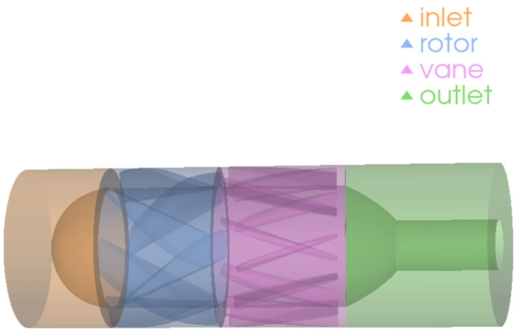

# Parametric Impeller Summoner 🏭

> Preprocess of the Symmetric-based Physics Oriented Neural Integral Computation [SymPhONIC](https://github.com/LokimuKH19/SymPhONIC), which is a novel PINN framework dedicated to analyzing impellers

## Contents
- `BladeGenerator.py`: to create a **parametric** 3D-Blade 
- `Assembly.py`: to **parametricly** summon a certain turbo machinery
- `FluidSummoning.py`: to compute the fluid domain of the previous **parametric** turbo machinery



## 🖊 Update Records 
### Sept.12, 2025
- Make sure the model could be generated in a watertight, closed volumn and can be directly import to the CAD/3D modeling softwares.
- All parameters could be transfered by a json file to describe a pump design. You don't have to use the stl/vtk file directly to save spaces.

### Sept.14, 2025
- 1. Updates to `assembly.py`:
  - Outlet shaft and diffuser modeling fixed: Previously, the outlet shaft penetrated the diffuser without properly subtracting volume, leaving a hollow interior. Now, the diffuser and shaft are correctly combined so the solid domain is physically consistent.
  - Water-tightness checks reinforced: Ensured that the assembly, including rotor, vane, inlet, and outlet, passes watertight validation, making it suitable for CFD preprocessing.
  - Preparation for CFD-ready flow domain: Adjustments were made so that flow regions can be properly subtracted from solids without geometry errors.
  - Some small improvements on its robustness
- 2. New module: `FluidSummoning.py`: Provides the ability to generate CFD-ready fluid domains corresponding to pump components.
 
### Sept.20 2025
Sorry for suspending the updates for such a long time. A new function in `FluidSummoning.py` has been proposed which can choose the **filetype**(`vtk/stl/both/json_only`) of the exported fluid domain. Among them the `vtk` mode contains the Naming/Numbering Function of each surfaces with traingle mesh exported to the `FluidDomain` folder, of which a description `json` file starts with "BoundaryID_Map" contrains the description of the correspounding relationship between the number (for the convenience of being identified by Ansys Fluent and similar commercial softwares) and the name of each boundary.
 
## Dependencies Description
It is recommended to download "Blender" and "OpenSCAD" when using this software, and add them into Path (Environment Variable) for boolean calculation.

If you are using later version of the `trimesh` package, the "OpenSCAD" engine will no longer available. Instead, you can download `pymanifold` directly by 

```cmd
pip install pymanifold
``` 

in the `cmd` window and added a parameter `engine="manifold"` when conducting a boolean calculation, for example:

```python
tmp = trimesh.boolean.difference([fluid_tm, cutter_bottom], engine="manifold")
```

