### 500-Epoch Comparison Summary

This section summarizes five 500-epoch mixed-training experiments under the same single-case setting. All experiments use a grid resolution of $n=64$, data loss weight $1.0$, physics loss weight $0.1$, and the finite-volume Rhie-Chow physics loss with second-order upwind convection.

This result is generated at `rho=10650, mu=0.006` for comparison only. (In formal cases we used `mu=0.0016`)

### 1. Experimental Setup

| Experiment | Actual Operator | Modes | High Modes | Width | Depth | Real-Valued Parameter Equivalent | Notes |
| --- | --- | ---: | ---: | ---: | ---: | ---: | --- |
| `500EpochFNO-1502572Paras` | FNO | 8 | - | 44 | 6 | 1,502,572 | Width-matched low-frequency FNO |
| `500EpochCFNO-1519962Paras` | CFNO | 8 | - | 36 | 6 | 1,519,962 | Width-matched Fourier-Chebyshev model |
| `500EpochFNO16modes` | FNO | 16 | - | 22 | 6 | 1,491,968 | Higher Fourier cutoff with matched scale |
| `500EpochHF-FNO-1567458Paras-BESTSTATE` | HF-FNO | 8 | 16 | 17 | 6 | 1,567,458 | Best validation-loss state restored |
| `500EpochHF-CFNO-1490160Paras` | HF-CFNO | 8 | 16 | 16 | 6 | 1,490,160 | High-frequency CFNO reference |

Note that though the HF-Branch is only applied in the width direction, demonstrating satisfying enough results.

The real-valued parameter equivalent counts each complex-valued spectral parameter as two real degrees of freedom.

### 2. Main Quantitative Results

| Experiment | Train Data Loss | Train Physics Loss | Validation Total Loss | $q_{\mathrm{pred}} / q_{\mathrm{target}}$ | Velocity Relative $L^2$ | Velocity Cosine | Pressure Relative $L^2$ | Pressure Pearson |
| --- | ---: | ---: | ---: | ---: | ---: | ---: | ---: | ---: |
| FNO, $m=8$, $w=44$ | 0.8016 | 2.9313 | 1.0950 | 3.2705 / 3.6026 | 0.4462 | 0.9111 | 0.8047 | 0.0929 |
| CFNO, $m=8$, $w=36$ | 0.8023 | 3.3953 | 1.1420 | 3.2404 / 3.6026 | 0.4478 | 0.9116 | 0.8042 | 0.1004 |
| FNO, $m=16$, $w=22$ | 0.8093 | 2.4506 | 1.0543 | 3.2654 / 3.6026 | 0.4455 | 0.9109 | 0.8059 | 0.0914 |
| HF-FNO, $m=8$, $m_h=16$, $w=17$ | 0.2011 | 0.7837 | 0.2010 | 3.6026 / 3.6026 | 0.2071 | 0.9793 | 0.1900 | 0.9752 |
| HF-CFNO, $m=8$, $m_h=16$, $w=16$ | 0.1332 | 0.8634 | 0.2323 | 3.6052 / 3.6026 | 0.2278 | 0.9777 | 0.2205 | 0.9701 |

### 3. Local Physics Residuals

| Experiment | Continuity p95 | Momentum RMS p95 | Interpretation |
| --- | ---: | ---: | --- |
| FNO, $m=8$, $w=44$ | 0.0374 | 0.0266 | Low residual, but weak CFD-field agreement |
| CFNO, $m=8$, $w=36$ | 0.0358 | 0.0254 | Similar to FNO, with no clear advantage |
| FNO, $m=16$, $w=22$ | 0.0313 | 0.0232 | Lowest residual, but still poor pressure and velocity matching |
| HF-FNO, $m=8$, $m_h=16$, $w=17$ | 0.0610 | 0.0479 | Better CFD agreement, with residuals concentrated near high-gradient structures |
| HF-CFNO, $m=8$, $m_h=16$, $w=16$ | 0.0689 | 0.0539 | Similar high-frequency behavior, slightly higher residual p95 |

The low-frequency models produce smaller local residuals, but this does not imply better agreement with the CFD solution. They tend to converge toward smoother low-frequency fields. The high-frequency models retain sharper pressure and velocity structures, which increases localized residuals near blades and wakes but substantially improves global field similarity.

### 4. Main Observations

### 4.1 FNO and CFNO Are Nearly Identical at Matched Scale

At approximately $1.5$ million real-valued parameters and $m=8$, FNO and CFNO show very similar behavior:

- Velocity relative $L^2$ remains near $0.446$.
- Pressure relative $L^2$ remains near $0.804$.
- Pressure Pearson correlation remains close to $0.1$.
- Final data loss remains near $0.8$.

This suggests that the Chebyshev branch alone does not resolve the dominant approximation bottleneck in this setting.

### 4.2 Increasing FNO Modes Alone Is Insufficient

The $m=16$ FNO experiment increases the Fourier cutoff while reducing width to keep the parameter scale comparable. However, the result remains close to the $m=8$ FNO baseline:

- Velocity relative $L^2$: $0.4455$
- Pressure relative $L^2$: $0.8059$
- Pressure Pearson: $0.0914$

Thus, simply allowing more Fourier modes is not enough. The model needs an explicit mechanism that can learn to use high-frequency information effectively.

### 4.3 High-Frequency Models Give the Main Improvement

Both HF-FNO and HF-CFNO substantially improve agreement with CFD. Compared with low-frequency FNO/CFNO, the high-frequency models reduce velocity error by roughly a factor of two and improve pressure correlation dramatically.

For HF-FNO:

- Velocity relative $L^2$ decreases to $0.2071$.
- Pressure relative $L^2$ decreases to $0.1900$.
- Pressure Pearson increases to $0.9752$.
- The predicted flow rate matches the target almost exactly.

For HF-CFNO:

- Velocity relative $L^2$ decreases to $0.2278$.
- Pressure relative $L^2$ decreases to $0.2205$.
- Pressure Pearson increases to $0.9701$.
- The predicted flow rate is also very close to the target.

These results indicate that Fourier coordinate features, multi-band spectral filtering, and local high-pass correction are the dominant contributors to the observed improvement.

### 4.4 Chebyshev Branch Is Not the Primary Source of Improvement

The corrected HF-FNO best-state result is slightly better than the HF-CFNO result in the current 500-epoch single-case comparison:

- HF-FNO velocity relative $L^2$: $0.2071$
- HF-CFNO velocity relative $L^2$: $0.2278$
- HF-FNO pressure relative $L^2$: $0.1900$
- HF-CFNO pressure relative $L^2$: $0.2205$

This supports the hypothesis that the main improvement comes from explicit high-frequency modeling rather than from the Fourier-Chebyshev mixed backbone itself. The Chebyshev branch may still provide stability in some boundary-dominated settings, but in this test it is not necessary for strong performance.

### 5. Figure References

### 5.1 FNO, $m=8$, $w=44$

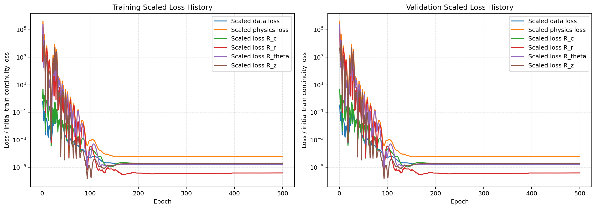

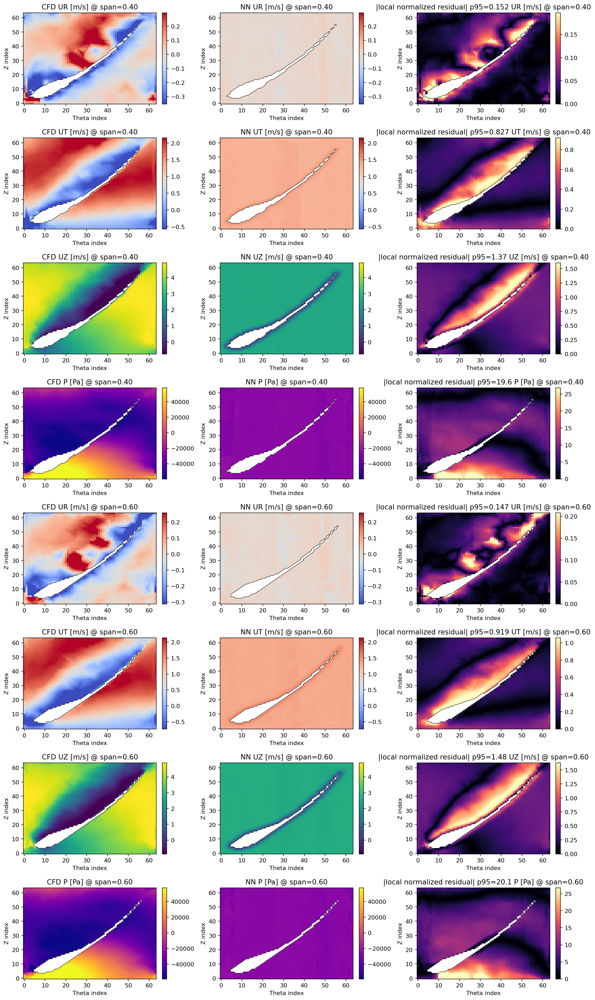

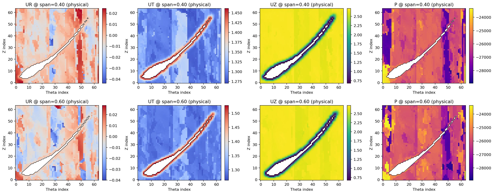

### 5.2 CFNO, $m=8$, $w=36$

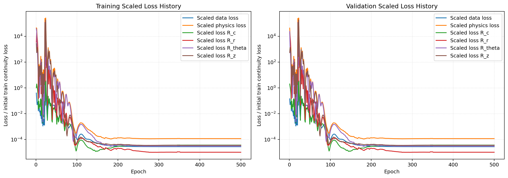

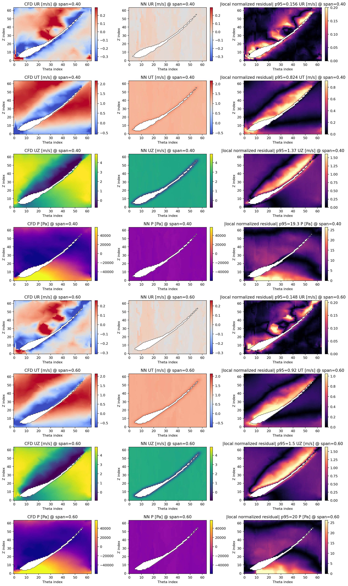

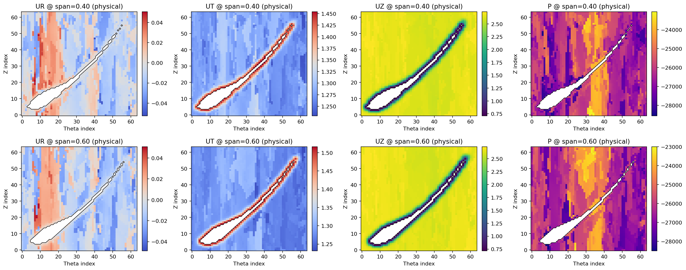

### 5.3 FNO, $m=16$, $w=22$

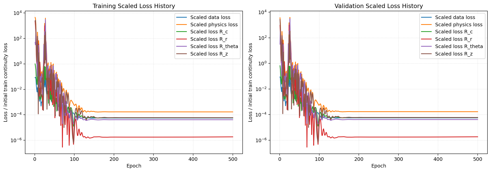

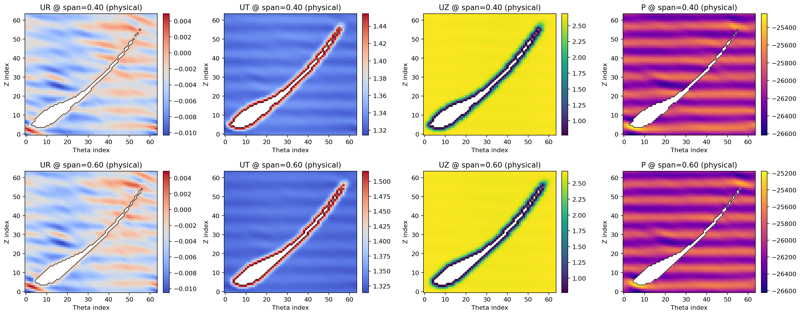

### 5.4 HF-FNO, $m=8$, $m_h=16$, $w=17$

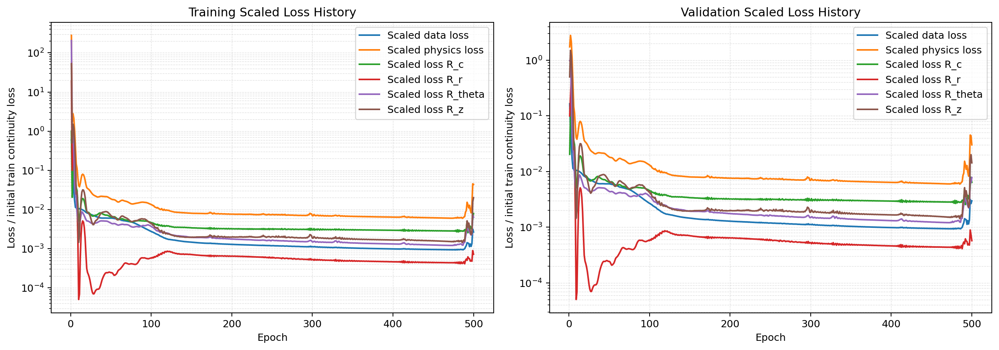

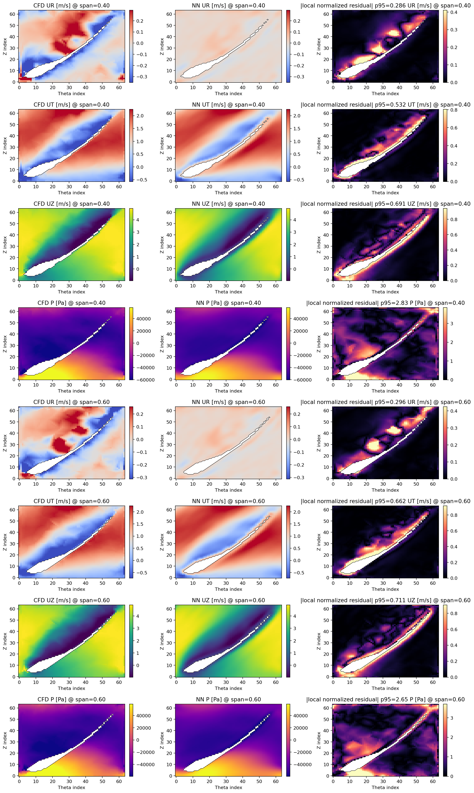

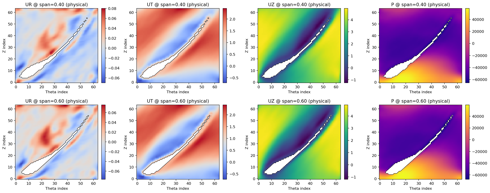

### 5.5 HF-CFNO, $m=8$, $m_h=16$, $w=16$

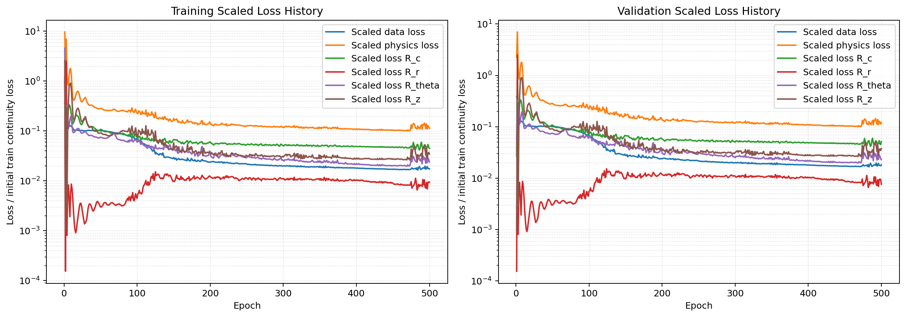

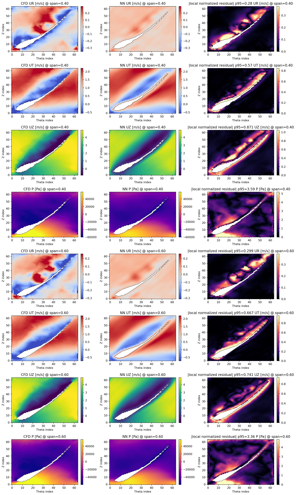

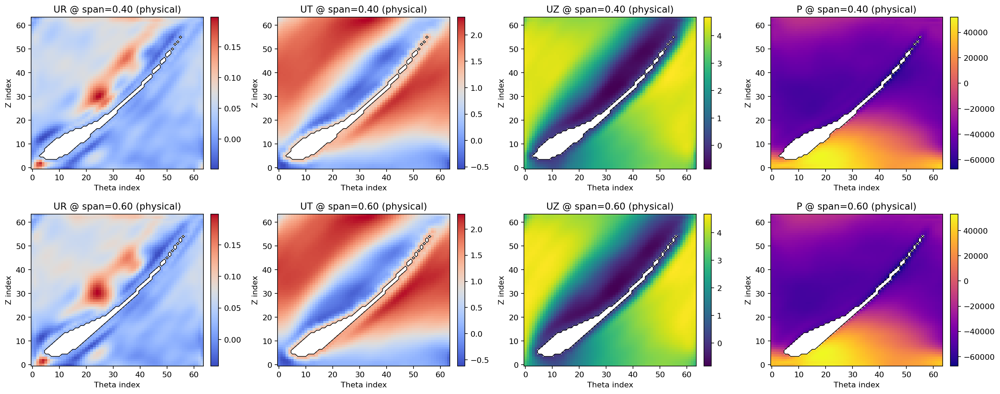

### 6. Conclusion

The 500-epoch comparison shows that low-frequency FNO, CFNO, and higher-mode FNO all fail to reproduce the CFD pressure and velocity structures accurately. Their residuals may be small, but their field agreement is weak.

The high-frequency models are substantially stronger. The corrected HF-FNO best-state result is the best among the five experiments, slightly outperforming HF-CFNO at comparable parameter scale. Therefore, the current evidence supports the conclusion that the explicit high-frequency mechanism is the key factor, while the Chebyshev branch is not essential in this single-case 500-epoch setting.
