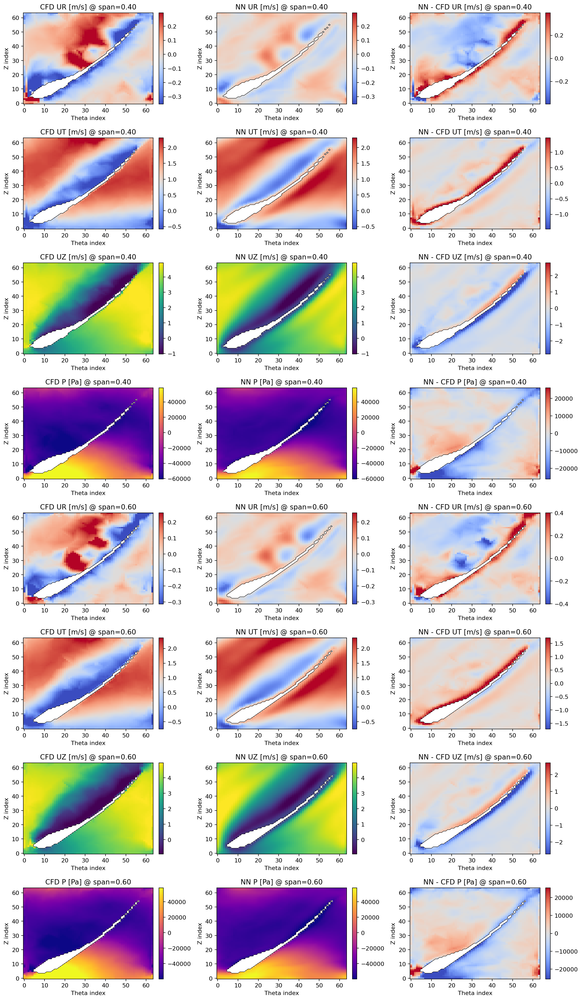

# Surrogate Modeling for the Flow Field in Axial Turbo Machineries

This filefolder facilitates an end-to-end mapping from the blade geometric definition (and operating conditions) to the flow field in the blade area directly.

## Contents

### Codes
- `AnnularCoette.py`: Original annular coette flow (2D) problem solved with dimensionless SIMPLE. (Example only, for running available version, see in [symphonic](https://github.com/LokimuKH19/SymPhONIC) repo.)
- `AnnularCoetteSurrogate.py`: The surrogate version of `AnnularCoette.py` which tests the theoretical accuracy of each neural operators in `NeuralOperators.py`.
- `BladeImport.py`: Converts the parametric blade geometry into the mask of the Immerse Boundary Method (IBM), which could be transfered into both CFD and surrogate modeling workflow.
- `DataGenerator.py`: Generates CFD data in the dimensionless cylinderical coordinates via alternative traditional iteration schemes for validating and training surrogate models.
- `DataGenerator3D.py`: Formal CFD data generator, used 3D SIMPLE algorithm to create training data for surrogate models. 
- `PressureUpdaters.py`: Solvers of pressure correlation equation in CFD workflow.
- `PressureUpdaters3D.py`: 3D version of `PressureUpdaters.py`, corresponding to `DataGenerator3D.py`.
- `SurrogateModeling.py`: The main process of the current modeling methodology.
- `SurrogateModelingUtils.py`: Necessary dependencies for `SurrogateModeling.py`.
- `NeuralOperators.py`: Operator learning toolkit.
- `KKTProjectionOperators.py`: KKT projection toolkit for operator learning case.
- `SurrogateModelingConfig.py`: FlowCaseConfig and the definition of the dimensionless coordinate system.
- `SurrogateModelingData.py`: Physics case definition, CSV Fluent data import, interpolation and the interface to convert original data into the dimensionless grid.
- `SurrogateModelingPlots.py`: all Matplotlib/PyVista image creation, post process, CFD comparison and spectrum analysis.
- `SurrogateModelingKKT.py`: the creation and interface of `KKTProjectionOperators.py`
- `SurrogateModelingLegacy.py`: old versions of main process and the pure physics debug workflow.

---
### Documents
- `Dimensionless Document.pdf`: The current plan for data generator (in Chinese).
- `SurrogateModeling_Methodology.md`: Current workflow of the surrogate modeling.
- `DataGenerator3D_simple.md`: Current workflow of the data generation method.

---
### FileFolders
- `surrogate_formal`: running logs of the main program `SurrogateModeling.py`
  
------

## Updates

### Apr 28th, 2026
Finished `BladeImport.py` thoroughly.

### May 2nd, 2026
Updated `SurrogateModeling.py` and its dependencies `SurrogateModelingUtils.py`, facilitating the whole process of flow field surrogate modeling of the axial pump at certain operating conditions using a 2D-FNO([CFNO](https://github.com/LokimuKH19/SymPhONIC)) which shares parameters for each $(\Theta, Z)$ cylinderical layer. It supports model training, saving, reading and other CFD pre-post processes.

### May 4th, 2026
Updated `SurrogateModeling.py`. The 2 constants in the IBM mask are set as learnable parameters now.

### May 5th, 2026
Updated `DataGenerator.py` and its dependencies `PressureUpdaters.py`. We finally decided to apply a more stable COUPLE method with pseudo transient and geometric multigrid (GMG) pressure updater to substitute the SIMPLE algo we adopted before... and thanks to Codex, it converged now.

### May 6th, 2026
Updated `DataGenerator3D.py` and the corresponding dependencies `PressureUpdaters3D.py` which were decided as the formal data generators.

### May 7th, 2026
Updated `KKTProjectionOperators.py` to enforce the KKT projection during the training of the surrogate model, ref:"Chen, H., Flores, G. E. C., & Li, C. (2024). Physics-informed neural networks with hard linear equality constraints. Computers & Chemical Engineering, 189, 108764."
Updated `NeuralOperators.py`, trying to make the CFNO more sensitive to high-frequencied modes of the solution.

### May 10th, 2026
Updated `AnnularCoette.py` and its surrogate version `AnnularCoetteSurrogate.py` to show theoretical results. 3D versions of each neural operators are also implemented in `NeuralOperators.py`.

### May 15th, 2026
Updated the main programme, allowing the usage of CFD data (Fluent .csv solution file) as high-frequencied supervision now.

### May 16th, 2026
Finally, I figured out how to keep the semantical consistency of CFD data and surrogate modeling: THE FVM DISCRETION SHOULD BE STRICTLY FULFILLED. By referencing the contents in `Dimensionless Document.pdf` I modified the main program `SurrogateModeling.py`, ensuring the Rhie-Chow interpolation and other settings are realized as originally designed, and finally obtained physically explainable results in the filefolder `surrogate_formal/CFNO-VeryGoodResult`, where the comparison of CFD data and NN prediction demonstrates the accuracy of this surrogate model, as shown below:

